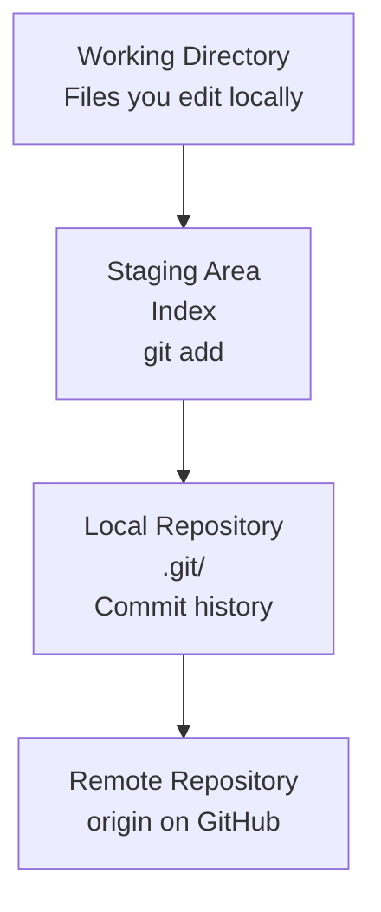

# 01: Git Fundamentals

## 1. Why Git Exists

Git is a distributed version control system. It allows you to:

- Track edits to files over time
- Revert mistakes without losing work
- Collaborate with team members safely
- Maintain a history of experiments, reports, and code changes

For data science projects, Git is especially important because analysis code, notebooks, and model pipelines evolve quickly and often need to be reviewed by others.

## 2. Git Architecture: The Mental Model

A common way to understand Git is to separate the repository into distinct areas:



### Working Directory
This is the current folder on your laptop where you edit files.

### Staging Area
This is where Git collects the changes you want to include in the next commit.

### Local Repository
This is the `.git/` directory that stores the commit history and metadata.

### Remote Repository
This is the server copy, usually GitHub, which allows collaboration with teammates.

## 3. Installing and Configuring Git

### Set your identity

```bash
git config --global user.name "Your Name"
git config --global user.email "yourname@example.edu"
```

### Recommended defaults

```bash
git config --global init.defaultBranch main
git config --global core.editor "code --wait"
```

### Check your configuration

```bash
git config --global --list
```

Example output:

```text
user.name=Your Name
user.email=yourname@example.edu
init.defaultBranch=main
core.editor=code --wait
```

## 4. Initializing a Repository

To start a new project:

```bash
mkdir ds-project
cd ds-project
git init
```

Example output:

```text
Initialized empty Git repository in /home/student/ds-project/.git/
```

This creates a `.git/` directory, which is the local repository metadata.

## 5. Cloning an Existing Repository

```bash
git clone https://github.com/club/project.git
```

Or with SSH:

```bash
git clone git@github.com:club/project.git
```

Example output:

```text
Cloning into 'project'...
remote: Enumerating objects: 45, done.
remote: Counting objects: 100% (45/45), done.
remote: Compressing objects: 100% (16/16), done.
remote: Total 45 (delta 10), done.
Receiving objects: 100% (45/45), 9.2 KiB | 1.11 MiB/s.
```

## 6. The Core Git Workflow

This is the daily loop students use most often.

### Check status

```bash
git status
```

Typical output:

```text
On branch main
Your branch is up to date with 'origin/main'.

Changes not staged for commit:
  modified:   README.md

Untracked files:
  script.py
```

### Add changes to the staging area

```bash
git add README.md script.py
```

If you want to stage everything:

```bash
git add .
```

### Commit those changes

```bash
git commit -m "feat: add exploratory notebook starter"
```

Example output:

```text
[main 4a7c9df] feat: add exploratory notebook starter
 2 files changed, 18 insertions(+)
 create mode 100644 README.md
 create mode 100644 script.py
```

### View recent history

```bash
git log --oneline --graph --decorate --all
```

Example output:

```text
* 4a7c9df (HEAD -> main) feat: add exploratory notebook starter
* 7d1b4f2 chore: add project skeleton
* 3c9aa21 docs: initial project setup
```

## 7. Inspecting Changes

Before committing, it's useful to see what changed.

```bash
git diff
```

This shows the exact edits between the working directory and the staged version. For staged changes only:

```bash
git diff --cached
```

## 8. Undoing Mistakes Safely

Git is designed to make mistakes recoverable, but the correct command depends on what you want to undo.

### Restore a modified but unstaged file

```bash
git restore README.md
```

This discards working-directory changes, returning the file to the last committed state.

### Unstage a file without deleting changes

```bash
git restore --staged README.md
```

Now the file remains modified in the working directory, but it is no longer staged.

### Amend the previous commit

```bash
git commit --amend -m "fix: correct notebook setup steps"
```

This changes the previous commit message or includes additional staged changes. Use it carefully when the commit is not yet public or shared.

## 9. Reset vs Revert

### `git reset`
`git reset` moves the current branch pointer backward.

#### Soft reset

```bash
git reset --soft HEAD~1
```

This moves the branch back one commit, but keeps the changes staged.

#### Hard reset

```bash
git reset --hard HEAD~1
```

This erases the last commit and discards associated changes from the working tree. Use with caution.

### `git revert`

```bash
git revert HEAD
```

This creates a new commit that undo the changes made in the previous commit without rewriting history. This is usually safer for shared branches.

## 10. Common Student Workflow Example

```bash
# Start in a project
cd ds-club-analysis

# See current status
git status

# Create or edit files
# ...

# Track the relevant files
git add analysis.py notebook.ipynb

# Save a checkpoint
git commit -m "feat: add baseline model training script"

# Review the history
git log --oneline --graph -n 5
```

Example output:

```text
* 7d20ef1 feat: add baseline model training script
* 4a7c9df docs: add project overview
* 3c9aa21 chore: create repo skeleton
```

## 11. Best Practices for Commit Hygiene

- Commit frequently, but keep each commit focused.
- Write clear messages that describe the change.
- Avoid mixing unrelated work in one commit.
- Prefer meaningful wording such as `feat:`, `fix:`, `docs:`, `chore:`.
- Check `git status` before every commit.

## 12. Summary

Git fundamentals are simple at the surface but powerful in practice:

- Work in your local project folder
- Stage only the files you want
- Commit often with clear messages
- Review history before changing or deleting work
- Use safe undo commands rather than risky destructive ones

For the next step, continue to [02: Branching and Merging](./02-branching-and-merging.md).
