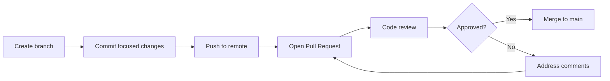

# 03: Collaboration and Pull Requests

## 1. Working with Remotes

A remote is a hosted copy of your repository, usually on GitHub. Git can interact with many remotes, but most student projects use a single remote called `origin`.

### View configured remotes

```bash
git remote -v
```

Example output:

```text
origin  git@github.com:club/ds-project.git (fetch)
origin  git@github.com:club/ds-project.git (push)
```

## 2. Fetching and Pulling Changes

Update your local branch with remote changes:

```bash
git fetch origin
```

Then merge or rebase locally:

```bash
git pull origin main
```

This is equivalent to fetching and then merging the latest tracked branch state.

## 3. Pushing a New Branch

```bash
git push -u origin feat/data-cleaning
```

The `-u` flag sets upstream tracking so future pushes are simpler:

```bash
git push
```

## 4. Pull Request Lifecycle

The standard GitHub collaboration workflow is:



1. Create a branch for a task.
2. Make focused edits.
3. Commit them with a clear message.
4. Push the branch to GitHub.
5. Open a pull request.
6. Review and address comments.
7. Merge after checks pass.

### Example flow

```bash
git switch -c feat/model-evaluation
git add .
git commit -m "feat: add baseline evaluation metrics"
git push -u origin feat/model-evaluation
```

Then open a pull request in the GitHub UI.

## 5. What Makes a Good Pull Request?

A strong PR is easy to review and easy to trust.

It should include:

- a clear problem statement
- a summary of the solution
- relevant files touched
- validation steps taken
- any risk notes or known limitations

## 6. Pull Request Template for Data Science Projects

Use a PR template like this:

```md
## Problem Statement
Describe the issue, bug, or research question addressed by this change.

## Approach
Explain the method, code path, or analysis steps implemented.

## Baseline vs. New Results
- Baseline: <metric or previous result>
- New: <metric or updated result>
- Improvement: <delta or interpretation>

## Data / Model Notes
- Dataset used
- Feature set or preprocessing changes
- Model version or training run identifier

## Sanity Checks
- Notebook outputs stripped / cleaned
- .env or secrets not committed
- Data files excluded from Git
- Relevant tests or validation run
- Documentation updated if needed

## Review Questions
List specific questions or concerns for reviewers.
```

## 7. PR Etiquette

Good pull request behavior includes:

- keep PRs small and focused
- explain why the change exists
- ask for targeted review, not broad noise
- respond respectfully to comments
- do not merge your own changes without approval in team settings
- ensure checks pass before merging

## 8. Code Review Best Practices

When reviewing a PR:

- check correctness, not just style
- assess reproducibility
- look for hidden data leaks or secret exposure
- question assumptions in model or analysis logic
- prefer concrete, actionable review comments

## 9. Conventional Commits Reference

A lightweight commit convention makes review and changelog generation easier.

| Prefix | Meaning | Example |
| --- | --- | --- |
| `feat:` | New feature or capability | `feat: add model training CLI` |
| `fix:` | Bug fix | `fix: correct missing label mapping` |
| `perf:` | Performance improvement | `perf: speed up dataframe preprocessing` |
| `chore:` | Maintenance or tooling | `chore: update lint config` |
| `docs:` | Documentation changes | `docs: add setup instructions` |
| `refactor:` | Code restructuring | `refactor: simplify data cleaning pipeline` |
| `test:` | Tests added or changed | `test: add validation for preprocessing` |

## 10. Merging the Pull Request

In GitHub, a PR can be merged with one of several strategies:

- Merge commit
- Squash and merge
- Rebase and merge

For many student and research repositories, squash merge is convenient because it keeps history concise and reviewable.

## 11. Example Collaboration Scenario

```bash
git switch main
git pull origin main
git switch -c feat/cleaning-pipeline
git add src/preprocess.py
git commit -m "feat: add preprocessing pipeline"
git push -u origin feat/cleaning-pipeline
```

Then on GitHub:

- Open a PR
- Add a short summary
- Reference the issue if one exists
- Ask for review
- Merge after comments are addressed

## 12. Summary

GitHub turns local Git work into a team workflow. The main idea is not simply to push code, but to create a transparent process for discussing changes, validating them, and merging with confidence. This is especially important in data science, where notebooks, pipelines, and models need discipline and reproducibility.

Continue to [04: Data Science Best Practices](./04-data-science-best-practices.md).
