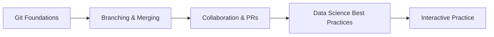

# Data Science Club: Git & GitHub Engineering Guidelines

This learning path is designed for Data Science Club members who want a practical, production-ready workflow for versioning code, collaborating on notebooks, and shipping analyses responsibly. The goal is not only to learn Git syntax, but to develop habits that help teams work safely, review code effectively, and keep research reproducible.

## Learning Path Overview

This collection is organized as a self-paced curriculum for students and contributors who want to revisit Git concepts anytime, without being tied to a single workshop session.



## Prerequisites

Before starting, make sure you have:

- Git CLI installed locally
- A GitHub account
- SSH keys configured, or a GitHub Personal Access Token for HTTPS
- A shell or terminal available on your machine
- A basic understanding of file systems and command line usage

### Verify your setup

```bash
git --version
ssh -T git@github.com
```

If SSH is not configured, use the GitHub credential helper or personal access token.

## Module Map

- [01: Git Fundamentals](./01-git-fundamentals.md)
- [02: Branching and Merging](./02-branching-and-merging.md)
- [03: Collaboration and Pull Requests](./03-collaboration-and-pr.md)
- [04: Data Science Best Practices](./04-data-science-best-practices.md)
- [05: Interactive Resources](./05-interactive-resources.md)
- [.gitignore Example](./.gitignore.example)

## Expected Learning Outcomes

By the end of this curriculum, each member should be able to:

- Explain the difference between the working directory, staging area, local repository, and remote repository.
- Initialize a repository, clone an existing project, and configure Git for personal use.
- Create commits with meaningful, conventional messages and inspect commit history.
- Use branches to isolate work, merge updates safely, and resolve simple conflicts.
- Push code to GitHub, open a pull request, and participate in code review feedback.
- Protect sensitive data and notebooks using .gitignore, environment variables, and reproducibility tooling.
- Recognize the difference between normal developer workflows and data science repository hygiene.

## Recommended Workflow

1. Create a branch for each task or experiment.
2. Keep commits small and meaningful.
3. Write useful commit messages and PR descriptions.
4. Do not commit raw data, credentials, or notebook outputs.
5. Review changes before merging.
6. Keep your environment reproducible with pinned dependencies.

## Quick Start

```bash
git config --global user.name "Your Name"
git config --global user.email "you@example.edu"
git config --global init.defaultBranch main
git config --global core.editor "code --wait"
```

Then choose a project and start with:

```bash
git clone <repository-url>
cd <repository-name>
git status
```

## Additional Notes

This curriculum is intentionally designed for students who may be new to version control but are already working with notebooks, scripts, models, and collaborative analysis. The guidance in these modules emphasizes correctness, safety, and reproducibility more than speed.

---

For the full learning path, start with [01: Git Fundamentals](./01-git-fundamentals.md).
